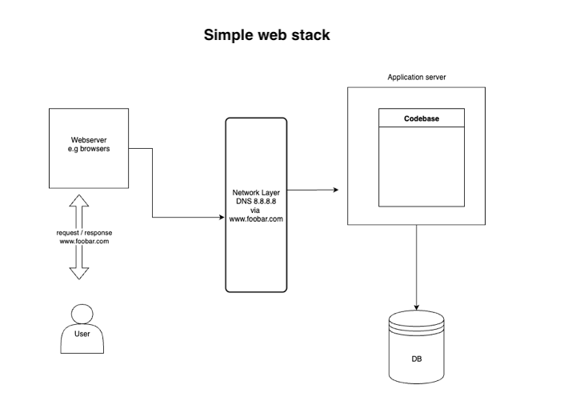

# Web infrastructure design
## TASK 0: Simple web stack

### What is a server: a computer that manages requests and response from and to the web server respectively, they can only be access via network protocols e.g TCP/IP

### What is the role of the domain name: A domain name is the human-readable name of a website, like foobar.com. Its role is to provide a simple way for people to access a website without having to remember the server's specific IP address.

### What type of DNS record www is in www.foobar.com: The www part in www.foobar.com is typically a CNAME (Canonical Name) record. This record acts as an alias, pointing the www subdomain to the primary domain's A (Address) record.

### What is the role of the web server: the webserver is a software that creates an interface between the users or stakeholder of an application by accepting requests from the users, establish communication with the server, and return server response to the user using the communication protocols, e.g of web servers are browsers.

### What is the role of the application server: application server is the core of an application, its basic role is to process application logic and return the response that is sent to the web server.

### What is the role of the database: the storage unit that stores, retrieve application data, its the application's memory.

### What is the server using to communicate with the computer of the user requesting the website: The server uses a network protocol called TCP/IP (Transmission Control Protocol/Internet Protocol) to communicate with the user's computer. 

## POTENTIAL ISSUES
### SPOF - single point of failure, if the application server or database fails the server won't be able to reach or return user required response.
### Downtime when maintenance needed (like deploying new code web server needs to be restarted): Server downtime due to system upgrade would affect application uptime.
### Cannot scale if too much incoming traffic: the application only has one application server which could create overload during high traffic or potential server downtimes
